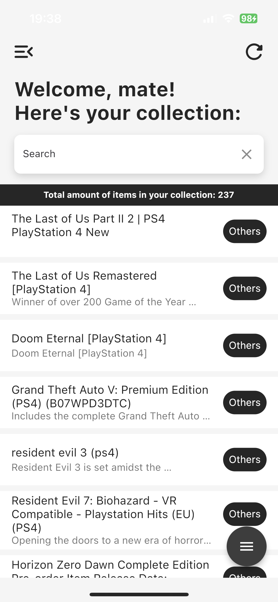

# Stuff Accounting

**Description**  
soon

**What you can do now?**  
- add new items by UPC
- add new own items 
- delete items
- export collection to json
- import collection from json
- 

**What do I want to add in the future?**  
soon

## Run Noto on your device from source code
> [!NOTE]
> For start confirm flutter instalation on your machine.
``` Bash
$ git clone https://github.com/denver-code/stuff_accounting
$ cd stuff_accounting
$ flutter pub get
$ flutter run --release
```
##  Build an APK
> [!NOTE]
> For start confirm flutter instalation on your machine.
``` Bash
$ git clone https://github.com/denver-code/stuff_accounting
$ cd stuff_accounting
$ flutter pub get
$ flutter build apk --split-per-abi
```
This commands results in three APK files:
```
    [project]/build/app/outputs/apk/release/app-armeabi-v7a-release.apk
    [project]/build/app/outputs/apk/release/app-arm64-v8a-release.apk
    [project]/build/app/outputs/apk/release/app-x86_64-release.apk
```


## Screenshot
